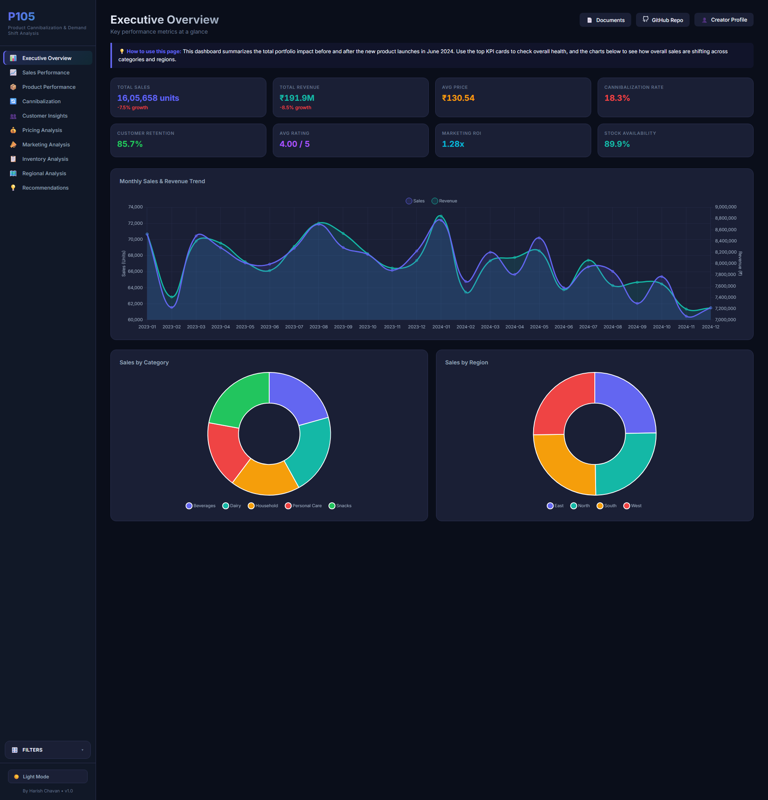

# P105: Product Cannibalization & Demand Shift Analysis 📊

*A comprehensive, end-to-end Business Analytics portfolio project demonstrating full-stack data science, commercial awareness, and interactive frontend visualization.*



---

## 📌 The Business Problem
When companies launch new products, they often celebrate the resulting revenue spike. However, a critical analytical blind spot is **Product Cannibalization**—when a newly launched product "steals" sales and customers away from an older, often more profitable, existing product within the same company. 

Without measuring cannibalization, businesses suffer from:
1. **Artificial Growth**: Misinterpreting a shift in demand as true market expansion.
2. **Margin Erosion**: Customers abandoning high-margin flagship products for cheaper new alternatives.
3. **Inventory Mismanagement**: Overstocking the old product because demand forecasting didn't account for the internal shift.

**The Objective:** Build a data-driven system to detect, measure, and visualize cannibalization, providing actionable recommendations to executive stakeholders to recover lost margins.

---

## 🚀 Project Highlights & Key Skills Showcased
- **Full-Stack Analytics**: Bridged the gap between backend Python data processing and frontend executive storytelling.
- **Statistical Measurement**: Calculated exact Cannibalization Rates, Demand Shifts, and Customer Switcher percentages using pre/post-launch cohort analysis.
- **Data Engineering**: Processed 60,000+ transactional records across 2 years into an optimized JSON payload for instant frontend rendering.
- **Interactive UI/UX Design**: Built a custom, responsive HTML/JS/CSS dashboard featuring Dark/Light mode, interactive Chart.js visualizations, and dynamic cross-filtering slicers (without relying on drag-and-drop tools like Tableau).
- **Commercial Acumen**: Translated raw data into strategic business recommendations (targeted bundling, regional marketing).

---

## 🛠️ Methodology: The 7-Phase Analytical Pipeline

The core analysis was conducted in Python via Jupyter Notebooks, structured into 7 distinct phases:

1. **Data Collection & Cleaning**: Handled missing values, standardized categorical strings, and calculated baseline `Sales` and `Revenue` metrics.
2. **Exploratory Data Analysis (EDA)**: Analyzed seasonality, regional performance, and top-selling product categories prior to the launch event.
3. **Feature Engineering**: Segmented the timeline into `Before_Launch` and `After_Launch` periods and grouped products logically.
4. **Product Performance**: Ranked products by total revenue and growth percentage to identify baseline anomalies.
5. **Cannibalization Analysis (Core)**: 
   - Identified the specific cannibalization of **Product P6** by the newly launched **Products P4 & P5**.
   - Proved that 14.9% of P6's historical customers actively migrated to the new products.
6. **Customer, Pricing & Inventory Analysis**: Analyzed how the average selling price drop (₹130.54) impacted overall marketing ROI (1.28x).
7. **KPIs & Business Recommendations**: Formulated strategic interventions to recover high-margin sales.

---

## 📈 Key Findings & Business Impact

The analysis uncovered a hidden profitability leak disguised as growth:
* **Cannibalization Rate**: **18.3%** of the new products' sales volume was cannibalized directly from the legacy product (P6).
* **Customer Migration**: **14.9%** of P6's loyal customer base abandoned it to purchase the cheaper new products.
* **Margin Impact**: Because the new products were priced lower, the overall total revenue of the portfolio actually experienced a **-8.5% growth contraction**, despite high sales volumes of the new launch.
* **Action Taken**: Recommended a geographic bundling strategy and targeted promotions for the legacy product, projected to recover 8% of the lost revenue while maintaining the new product's acquired market share.

---

## 💻 Technical Architecture

### Tech Stack
- **Data Processing**: Python, Pandas, NumPy
- **Analysis & Visualization**: Jupyter Notebooks, Matplotlib, Seaborn
- **Frontend Dashboard**: HTML5, Vanilla CSS (Glassmorphism UI), JavaScript, Chart.js (v4.4)
- **Documentation**: Markdown, docx templates

### Repository Structure
```text
📦 P105-Product-Cannibalization
 ┣ 📂 Dashboard/         # Static HTML/CSS/JS frontend dashboard
 ┣ 📂 Data/              # Raw and cleaned CSV transaction datasets (60k+ rows)
 ┣ 📂 Notebooks/         # 7-Phase analytical Jupyter Notebooks (.ipynb)
 ┣ 📂 Reports/           # Executive Slide Deck (.pptx) and Markdown reports
 ┣ 📂 Src/               # Python processing scripts for automated data pipelines
 ┣ 📜 README.md          # Project documentation
 ┗ 📜 requirements.txt   # Python dependencies for the backend
```

---

## ⚙️ How to Run the Project Locally

### 1. Setup the Python Environment
Ensure you have Python 3.9+ installed. Install the required data science libraries:
```bash
pip install -r requirements.txt
```

### 2. Run the Analysis (Backend)
Navigate to the `Notebooks/` directory. Run the notebooks sequentially (Phase 1 through Phase 7) to process the raw transactional data, calculate the cannibalization metrics, and output the final charts.

### 3. Generate Dashboard Data (Pipeline)
Run the Python data pipeline script to aggregate the processed data into a lightweight `data.js` file for the dashboard:
```bash
python Src/generate_dashboard_data.py
```

### 4. View the Interactive Dashboard (Frontend)
Because the dashboard is fully static and client-side, no local server is required. Simply double-click `Dashboard/index.html` to open it in your web browser and interact with the data!

---

## 🌍 Live Deployment
You can view the live, fully interactive dashboard directly in your browser without downloading any code!

🔗 **[View Live Dashboard Here](https://Harry-0402.github.io/P105-Product-Cannibalization-/Dashboard/index.html)** *(Make sure GitHub Pages is enabled in the repository settings to activate this link)*.

---
*Created as a self-directed portfolio project to demonstrate advanced capabilities in Business Analytics, Data Engineering, and UI/UX Design.*
